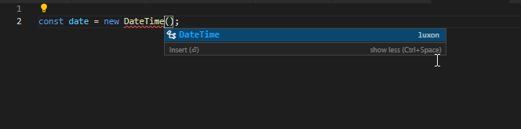
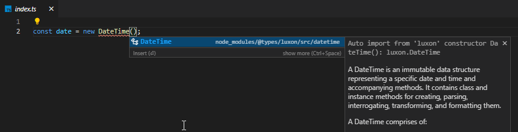

[vscode-132299](https://github.com/microsoft/vscode/issues/132299)

on 1.60.0
1. Use 'Trigger Suggest' action (ctrl+Space by default) on line 2 column 26 in `src/index.ts`

2. Push 'Enter'
3. Nothing happens

on 1.59.1
1. Use 'Trigger Suggest' action (ctrl+Space by default) on line 2 column 26 in `src/index.ts`

2. Push 'Enter'
3. Import statement is added at the top of the file
4. ???
5. profit
